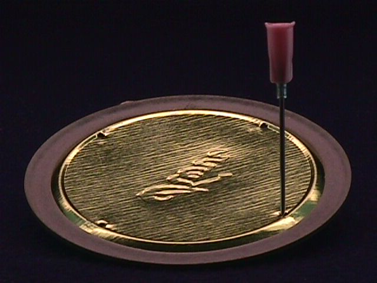
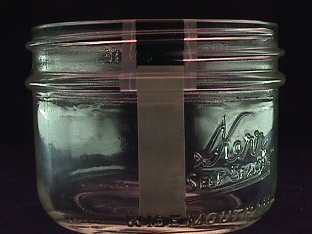

Jars and glasses to be used with this technique are 1/2 pint capacity (8 ounces) - (250 milliliters). They must have tapered sides and no shoulders, otherwise the fungus cakes won't easily come out of the jars.

Appropriate jars; (source - super markets and hardware stores)

1. KERR wide mouth half pint canning jar - preferable
2. BALL wide mouth half pint (similar to the KERR wide mouth half pint) - preferable
3. BALL regular mouth half pint canning jar
4. BALL half pint jelly jar
5. 1/2 pint (250 ml) capacity drinking glasses (tapered sides)

! NOTE: Even though the regular mouth BALL half pint and the regular mouth KERR half pint look similar, the KERR is not tapered.

## PF Substrate Formula

### by cups or milliliters 

* 1/4 cup of brown rice powder (60ml) 
* 1/2 cup of medium grade horticultural vermiculite (120ml) 
* 1/4 cup of water (60ml)

### or by volume

* one part brown rice
* one part water 
* two parts vermiculite

The water amount is the crucial element that variates the results. The different brands of vermiculite varies in water holding capacity, creating differing moisture levels. So one can always vary the water amount (less or more than 1/4 cup), take notes and compare results. The highest water content can really make a great fruiting and give several flushes when the balance between the substrate elements is good.

Not all vermiculite is the same. The coarseness varies quite considerably among different brands. The coarser type will hold less water than the finer type which will alter the water holding capacity. If the formulation (water content) results in a really wet or sloppy substrate, use less water. Keep notes on formulas for replicating the substrate formula that fruits the best.

The above formula utilizes "HORTICULTURAL" vermiculite - a medium grade. To ascertain the size of the vermiculite particles, observe them under a photo magnifier next to a millimeter ruler. The finer type of vermiculite has particles averaging around 1 millimeter across (some larger and some smaller). The coarser type has particles averaging around 4 or 5 millimeters across and up to 8 millimeters. Stores usually carry one type, the "horticultural grade".

To make homemade brown rice powder, place some regular brown rice in a small canister type coffee bean grinder and grind it to fine powder. Freshly ground brown rice is recommended over prepackaged type. The freshness sometimes makes a big difference.

!!!! NOTE Water quality is indeed important. I have found out that "natural" water is the water to use. It makes for better cultivation of this mushroom on this simple substrate. Distilled water is good for making spore solutions and syringes and storing spore solution. But for growing, they seem to like the "natural" water such as: swamp, lake, stream, pond, river, ground or any water that is rich in organics. I have heard that "mineral" type drinking water is good and makes a difference. I suppose that water seeping from an organic compost pile would be about the best.

If the measuring cup specs aren't true, the formulas will be off, setting up certain failure or diminished growth. Check the cup measurers this way: 1 cup is 237 milliliters which is 1/2 pint or 8 liquid ounces (English measurement). There are 2 cups in a pint, 2 pints in a quart and 4 cups in a quart.

Prepare the canning lid by placing it with the rubber sealing edge upwards on a supporting surface and with a sharpened 3 penny nail (held with vise grip pliers) (or ice pick), punch 4 holes inside the periphery of the rubber sealing edge.

When using two piece canning jar lids, the inner lid (with the rubber edges up) rests on the top of the jar and when the lid band is screwed off, the lid remains resting on the jar top. To make the lid and band act as one lid, place pieces of masking tape on the lid attaching the band to the lid. Then, the lid can be adjusted for air ventilation and looseness like an ordinary one piece jar lid (after spore inoculation).

## PF Substrate Jar Preparation

Steam sterilizing PF substrate jars with regular cookware is possible because there is no grain to cook up and the substrate is airy. Other regular jars (other than canning type) or small drinking glasses (with tin foil covering) can be substituted for these canning jars. To insure similar results, make sure the jars or glasses are tapered sided with no shoulder of any kind, and that they have a 1/2 pint (8 ounce - 250 ml) capacity. It is important to note, that jars somewhat larger than 1/2 pint can be unreliable for the PF TEK and fail easily, unless the grower has experience with the PF TEK and compensates the formula. The low form KERR 1/2 pint canning jar is the most versatile (fits into tight spaces et).

A 3 piece vegetable steamer (pot, basket insert & lid) is used for the steam sterilizing stage. Also, the stainless steel vegetable steamers that fold out and stand on the bottom of the pot are good. Anything is good as long as it keeps the jar bottoms off the pot bottom where the high temperature will crack the glass.

**Step 1.** Place 1/4 cup of bron rice powder into a mixing bowl. Add the water directly onto the brown rice powder and mix it up and give it a few minutes to soak in. Add the vermiculite on top of the brown rice slurry. Thoroughly mix the ingredients. An electric mixer works great for this and makes it quick and easy. If there is no electric mixer, a couple of table knives does the trick also. The mixture should feel damp and cohesive (sticks together well). More water (or less) can be used if experimenting to improve the fruiting. Mix Each jars substrate individually for loading to insure accurate formula rendering and the best possible fruiting.

**Step 2.** Fill the jar very loosely. Leave a 1/2 to 3/4 inch space at the top. Level the substrate. With a tissue or a fingertip, wipe the insides of the jar clear of substrate residue down to the top of the substrate (very important - prevents contamination at the top). Fill the top of the jar with plain dry vermiculite and level it off at the top. This upper layer will protect the wet substrate from air borne contaminants. It acts as a contaminant barrier. This is a Psylocybe Fanaticus original discovery. What this dry vermiculite layer does is protect the wet substrate from airborne contaminants and also absorbs and regulates moisture transpiration and condensation.

In the photo, the black tape is the depth for the dry vermiculite. The masking tape shows where the pf substrate goes. The top layer of dry vermiculite must be between 1/2" to 2/3" deep to provide protection from contaminants entering from above.

## Tamping Down Tek

Getting the substrate level correct is very important. A slight tamping down is required. To get an accurate leveling of the substrate, loosely load the 1/2 pint jar and level the top of the mixture with the top of the jar. Screw a cap on the top to hold the mixture in. With one hand, hold the jar and lightly slam the bottom of the jar on the other palm a couple of times to lower the mixture level to around 1/2"-2/3" from the top rim. Further level and adjust the substrate with a fork down to the proper height. Clean the inside of the jar down to the substrate level with your finger tip or a paper towel and fill the jar back to the top with dry vermiculite.

**Step 3.** Place the lid on the jar with the rubberized edge up (jagged edges of the needle holes down). Screw the lid band on. Place pieces of "professional" grade masking tape (holds on during steaming) over the needle holes. This is to protect the needle holes from contaminant entry. When steaming or pressure canning is performed, the jars must be protected from water dripping down from the underside of the pot lid caused by heavy condensation and drip off during boiling. This water can get into the jars by entering under the jar lids that arenŐt tight and soaking the substrate - throwing off the formula and setting up failure. To prevent this, wrap some tin foil around the cap to ward off the water. The tin foil can be removed after steaming (with the tape guarding the needle holes - or the tin foil can be left on until it is inoculation time.)

**Step 4.** Heat the pot of water to a boil first then put the jars into the pot with the lid bands loose so that the steam can penetrate the jars quickly. The jars can sit in water but make sure boiling water can't slosh into the jars. Turn the heat down and GENTLY steam the jars at the lowest possible boil for an hour in a TIGHTLY covered pot (gas stoves are the easiest to control) (begin the timing when the water begins boiling again). A good tight fitting pot lid is essential for successful steaming.

Be careful to not overheat the jars, this dries the substrate. Drying is evidenced by o.k. spore germination and halted growth (the fungus will spread but stop at a certain point depending on how dry the substrate has become). Generally, any halted growth (with no contamination) is a sign of dried substrate. This is an important concept that will enable diagnosis and correction of problems experienced with drying. The remedy is to increase the water content of the substrate formula in use. After the jars have cooled, tighten the lids and store them in a cool draft free place until you are ready to inoculate them. As long as the lid is very tight, PF substrate jars can be kept for long periods before they are to be used. The only danger to this is water moisture loss.

## Pressure Canner Use

PF jars and water bottles can be quickly sterilized with a pressure canner. For proper and safe use of the pressure canner, always refer to the manual that comes with it. If the canner is used and has no manual , try to get one from the manufacturer before using it. Pressure canners can be dangerous if used incorrectly.

### Sterilization Times

1. 1/2 pint PF substrate jars - 12 p.s.i. for 30 minutes
2. Water bottles - 12 p.s.i. for one hour
3. Syringes and needles - 12 p.s.i. for 10 minutes

## Control Jar Technique

After the jars are steam sterilized, let them cool, tighten the lids and let them sit uninoculated for several days. Watch for any colored growths or changes in the appearance of the substrate. The tell tale rancid odor of bacteria can be easily detected by loosening the jar lid and checking for the odor. If there is contamination at this stage, the sterilization technique needs to be checked. Most likely it will be a to short sterilization time. If there is a problem at this stage, lengthen the sterilization time. If the jars remain clean and unchanged, they are ready for spore syringe inoculation. If contamination occurs after inoculation, the syringe was contaminated or the dry vermiculite layer was breached during inoculation. 