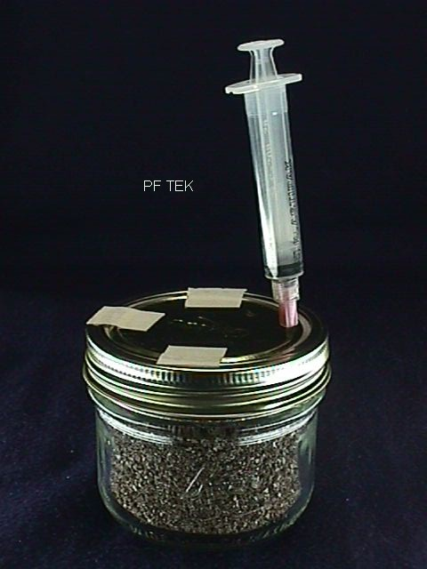
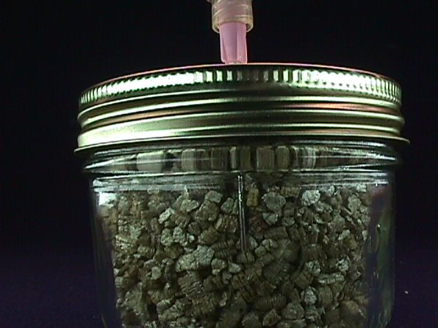
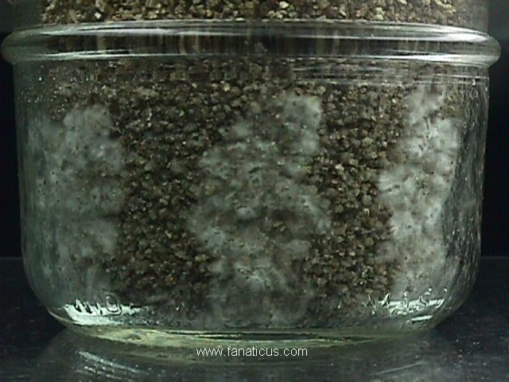

#  Inoculation Of The PF Substrate Jars

Any jar to be inoculated must be cool to the touch before proceeding. Make sure the jar lid is tight. Shake the syringe well and remove the tape from the syringe needle guard. This shaking of the syringe is important as to redistribute the spores in the water. Take off the tape covering the needle holes. Remove the needle guard and insert the needle through the lid hole. Tilt the syringe body back towards the center of the lid with the needle tip touching the glass. This distributes the spore water down the side of the jar, giving a good inoculation down the side of the substrate cake. Inoculate a few drops down each needle hole. As the syringe plunger is pressed, observe the needle tip against the inside of the glass. As soon as water appears around the needle tip, release the syringe plunger pressure. In between each hole inoculation, shake the syringe a little to keep the spores distributed. Use 1 cc per jar. This will allow the syringe to inoculate 10 jars. More spore solution per jar can be used (speeds colonization - I use 3 cc per jar), but fewer jars can be inoculated. If the syringe needle plugs up as it is inserted into the substrate, draw the needle back a little and it will unplug.

In this photo, the needle tip can be seen resting against the inside surface of the jar. Then, when the solution is injected, it will run down the side of glass, giving an even inoculation. It is also important to add, that the vermiculite in this jar photo is very course. This makes the needle more visible for the demo. This type of vermiculite is best avoided.

## Alocohal Flamming Technique

If the syringe needle is touched, flame the needle to sterilize it. An alcohol flame is a clean flame whereas a butane cigarette lighter leaves behind an undesirable soot residue. To produce a short burning alcohol flame, place a tequila shot glass upside down. Using an eyedropper, put a few drops of denatured alcohol fuel (hardware store) on the hollow bottom of the glass and touch it with a match or lighter. The blue flame will cleanly and safely sterilize small stainless steel tools. Heat the needle in the flame for a few seconds to resterilize it. There might be a few "pops" of boiling water spurt out of the needle, but the spores within the syringe are safe. If there is some left over spore solution, replace the needle guard and store the syringe for later use. Resterilize the needle immediately before re-use. Store the syringe in a dark, cool place.

Also, just wiping the needle with rubbing alcohol soaked cotton will sterilize the needle. Let the needle dry for several seconds to evaporate the rubbing alcohol (alcohol kills spores), or pass the needle through the flame for a couple of seconds to complete the evaporation of the rubbing alcohol.

## Inoculation Of PF Jars Without The Lids

This technique can also be used if canning jars are not available (1/2 pint wide mouth canning jars are perfect and should be used at all cost). If regular drinking glasses are to be used - use regular tapered sided drinking glasses (8 ounce - 250ml)

Jars can be inoculated without using a lid with holes punched. Before trying this technique, inoculate with the punched lid first. That will show how it works without any problems (almost fail proof).

The only precaution to observe is to disturb the dry top vermiculite layer as little as possible, especially when removing the needle after the inoculation. The underlying substrate must not be exposed to the air. Carefully move any disturbed vermiculite back into place (with your finger tip). Replace the tin foil cover after inoculation.

## Icubation Of Inoculated Jars

After inoculation of the jars, tighten the lid bands and retape the needle holes. A tight lid preserves the water content of the substrate (very very important) and the growing and spreading mycelium will do fine with a tight lid all the way to the appearance of the primordia (using the air in the jar only). Place the jars in a safe place out of direct sunlight. Indirect light is all that is required. If the temperature is kept around 70 degrees, germination will begin within 3 to 5 days. Germinating spores appear as small white fuzzy spots, quickly growing and spreading with cottony white growth and strandy "rhizomorphs". Any room temperature is O.K. If it gets cold indoors, over head light shinning down on the tops of the jars is a perfect heating technique for this culturing stage. A clamping type light with a reflector works well for this. If this is done, keep the temperature around 70 degrees (don't overheat the jars - monitor the temperature with a thermometer). A warm overall house temperature is fine. But in the overall view, cool temperatures are never a problem. The rule is to not overheat.

## The Canning Jar Lid (Loose Or Tight)

There are two choices with the lids during incubation - tight or loose. With a very high moisture content (good for fruiting), a tight lid can cause water to collect in the bottom of the jar. This is to be avoided. Water condensing in droplets on the inside of the jar during incubation is normal and is to be expected. If puddling on the bottom of the jar occurs, the lid should be kept on loose during incubation. Tape the canning jar lid to the band to make the lid act as a one piece lid for raising and lowering.

An excellent way of depuddling the jar is to use a long syringe needle and syringe. Without disturbing the top vermiculite layer, insert the long needle down to the bottom of the jar. Tilt the jar so that the water puddles down to the needle point and suction out the water. This works really great, but one needs an extra long needle to do it. Doing this can facilitate superb fruitings with the high water content without the puddling problems and possible deterioration of the substrate because of the water (drowning). With a high water content, there might be more than one depuddling procedure needed.

Also, there is another and even simpler way to depuddle the jar. One just simply inverts the jar and lets the water run down the side and is absorbed by the dry upper vermiculite layer. Most people do this and report excellent results.

If the substrate is on the dry side, a tight lid will preserve the moisture content. It is all a matter of the balance between the water needs of the mycelium, the size of the jar, the available air space in the jar and the type of vermiculite used. Only by simple experimenting and comparison can the right balance be found for a given set of conditions. Take notes and go with what fruits the best. But after many years of seeing all of this and all over the internet - web - the basic PF substrate formula as given rules.

After the substrate turns white with the mycelium (2 to 4 weeks after inoculation), the jars are left to sit in indirect light. The mycelium will continue to infiltrate the substrate until it gets enough food to trigger the fruiting cycle. In less than a week to a few weeks after surface colonization of the cake (cake appears all white), tiny white "pin" like structures begin to appear. This is called pinning. This is the beginning of the fruiting cycle. Soon after that, within the week, small round fungus growths appear that soon begin to turn yellow.

Lastly, "primordia" start to grow. These are tiny worm like structures with tiny reddish heads. These are the first mushrooms. 