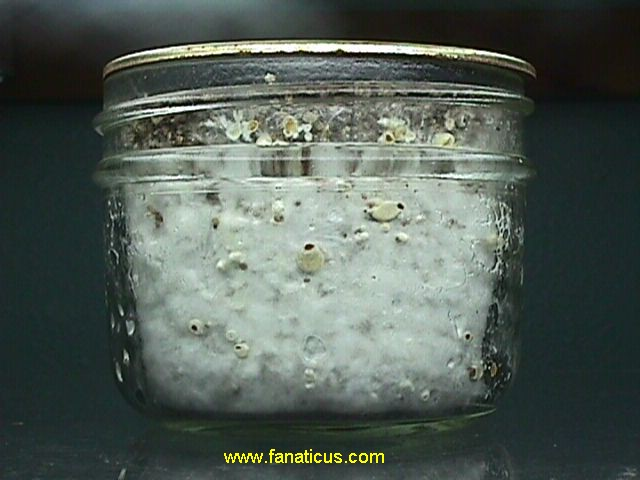
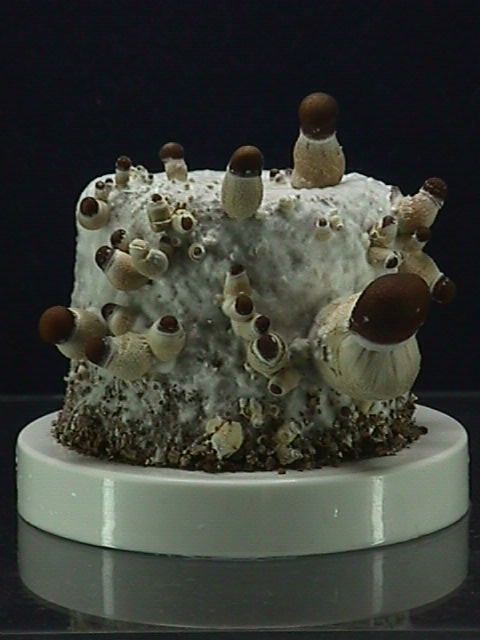

This photo is of a 1/2 pint PF substrate jar about 23 days after inoculation (done with 3 cc of spore water and incubated at 70 degrees Fahrenheit). The primordia have appeared and it is now time to birth the cake. Wait until you see this, and the fruiting will be maximized. The fruiting is fairly relative to the primordia that appear.

The best time to remove the fungus cake from the jar is when the primordia (tiny worm like structures with reddish heads) appear on the cake while still in the jar. Be careful not to damage them in handling. The rule is to handle with care.

Remove the lid. With a clean fork, scrape away the majority of the dry top vermiculite layer. There will probably be seen some wispy mycelium here and there in the top layer. That is a good sign showing the healthy agressive nature of the mycelium. Place an old jar lid over the jar mouth and turn the jar upside down. Lightly slam the jar down on a table cushioned with a magazine. The fungus cake will slide out onto the old jar cap (BIRTHDAY). What I usually do is hold the jar without the lid on (top down) in my hand and carefully wack the bottom of the jar with a rubber mallet - the cake births nicely. When handling the fungus cake, be careful as not to squeeze and bruise it. Bruising results in a bluish mark. This fungus is resilient and can tolerate a certain amount of handling, but handle it as least as possible. The aroma is distinctly mushroomy, very pleasant.

As soon as the fungus cake comes out of the jar, place the cake with the vermiculite covered end down onto a preprepared soaked vermiculite (or perlite) filled saucer, old jar cap, petrie dish ect. It really makes no difference what end of the cake is down. Also, for some of the cakes, follow the PF casing technique (later in this chapter) as a way to make the fruiting max. Leave some cakes uncased for comparison. Daub the cake with a piece of loose tissue paper to soak up any water droplets that may have deposited on the cake as it comes out of the jar (actually, this doesn't have to be done, because the freed cake drinks it up within several hours). Immediately after the birthday, place the cakes into the dual chambered terrarium for the fruiting cycle.

This is the cake a few days after the birthday. This is a healthy fruiting start. Some of these primordia will abort, but most will go on to full development.

Some of the first mushrooms to form are "aborts" (convoluted caps, gnarly stems and stunted growth), and ironically they are primo in magic alkaloids. They are even more powerful in magic than the stately beauties that will soon dominate the cake. The tiny "baby mushroom" aborts are likewise good. After witnessing the growth of the fungus, recognition of these aborts is easy. As long as the aborts are healthy and pure, they are primo. Also, another form of mutants will manifest, blobs of fungus with little or no cap, also good for harvesting. And along with these mutants, appear the perfect specimens, the sporocarps.

It has been reported that Psilocybe Cubensis is a "weak" mushroom. PF and others have seen this to be not necessarily so. It all depends on how it is grown, on what medium and how it is harvested and preserved.

The secret to potent mushrooms is in their age when picked. It has been scientifically proven that the small immature specimens are significantly more potent than the larger mature specimens. Over half of the small primordia that first form will abort (cease growing, convolute and deform - depending on the strain). Pick these before their heads turn black. A pointed knife blade works well for removing these high potency primordia. These are among the most potent. The abortive mushrooms are also high potency. Harvest them when they are young and before their heads turn black. When the fruit bodies are normal, harvest them before the veil under the cap breaks. The mushrooms will be smaller and their heads will be roundish. It is important to note that the mushroom cakes pictured in this book are all mostly well matured. While these mature specimens are beautiful and perfect, they are not as potent as the diminutive specimens. The mature specimens are good for spore collecting and showcasing (photography) but are weak in psychedelic potency.

Grow them on brown rice, harvest them when they are young and cool dry them with desiccant. When this is done, they are an entheogen of the highest order.

## Time Scale Of The Mushrooms

1. Spore inoculation to spore germination - within a week, at 70 degrees Fahrenheit.
2. Spore germination to complete colonization of the cake - about 2 to 4 weeks or more.
3. Complete colonization to fruiting cycle start - within 2 weeks or more.
4. The fruiting cycle lasts about 2 weeks. After the initial flush, the mycelium cake begins to turn blue and no more mushrooms form. If the cake is thoroughly cleaned of aborts and stray fungus blobs after the initial fruiting and given the PF double ended cake casing tek, fruiting can be doubled or even tripled.

All in all, the process takes from 4 - 6 weeks from spore inoculation to fruiting.

## Contanminant Source Identification

Contaminant invaders appear in various colors from pastels to black. If they appear, the culture is doomed. Bacteria contamination is detectable through the top dry vermiculite layer as a sour foul odor within two days after inoculation (and no spore germination). If the jar is bacteria contaminated, be careful in cleaning it. Keep a safe distance from the contaminated substrate. Don't inhale the bacteria and wash your hands after touching it. Bacteria can be dangerous.

## Non-Germination Of Spores

1. The spore solution was not inoculated deep enough down into the jar. Instead of running down the side of the jar and inoculating the substrate cake, the solution was absorbed by the non-nutritive top vermiculite layer. To avoid this from happening, make sure that the spore solution flows down along the sides of the substrate cake by inserting the syringe needle so that the tip is below the non-nutritive upper vermiculite layer.

2. The substrate jars were not allowed to cool down after sterilization, killing the spores. Inoculate only when the jar feels cool to the touch.

3. There is evidence now that syringe boxes can be exposed to killing heat during transit (a very rare occurrence). The possibilities are such as over heated airplane cargo holds during intense heat waves or a superheated mail truck parked all day in the sun. Another possibility is that on arriving at the mail box, the syringe package was allowed to sit inside a broiling sun heated mail box, killing the spores.

4. Spore syringes can survive freezing, but extreme low temperatures are probably destructive to the spores. 

