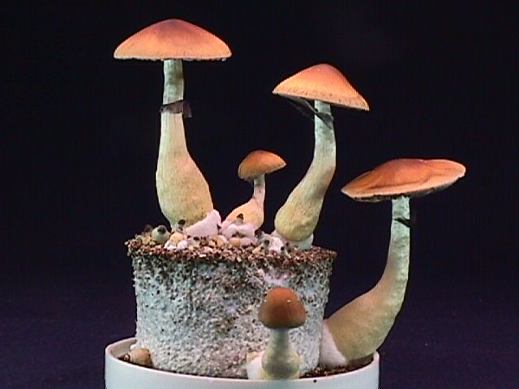
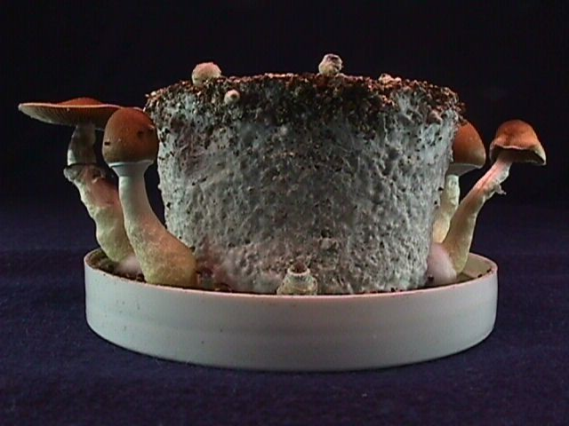

The photo on the top is a second flush off of a PF spore race cake. The cake under the first photo is a third flush.

## First: In Vitro Primordiation

There are many ways to extend the life of a cake and get more shrooms. The essential pf tek is to always allow primordia to appear on the cake in vitro. But not only that, wait for more. So when you spot the first primordia, wait around 3 to 4 more days before birthing. This stimulates more of them, and then your first flush will be fat. This invitro primordiation works well with most all of the spore races (strains) available. A few of the strains don't primordiate well invitro so they need to be birthed after about a month invitro, and then given the casing treatment.

## Second: The Casing Tek

Another really good way to max fruitings, it to not wait for the invitro primordiation. As soon as the cake turns completely white, it can be birthed and then cased. Immediately after the cake is first birthed is the time for a casing. fill a jar cap with vermiculite, soak it and drain it. Place the cake on top of the wet vermiculite.

Next, pour dry vermiculite onto the top of the cake until it starts to spill off. Flaten the top of the vermiculite with your finger to about 1/8 to 1/4 nch depth. With an eye dropper or old syringe, slowly drip water onto the top dry vermiculite layer until it is soaked completley.

Spraying and maintenance

Once the top layer is totally soaked, place the cake into the terrarium and leave it alone. Follow the Terrarium tek.

## Casing And Recasing

The cake whitening phenomenon

One of the most interesting effects of this tek, is the revitalization of the cake. After the initial fruiting, if it is really fat, the cake will be a bit blued. One of the signs of old age in PF cakes is the bluing that will occur. Most likely, the cause of this overall bluing of the cake is moisture loss and thirst of the cake. When the PF double ended cake casing tek is employed, the cake will gradually turn white again. After about a week under the casing tek, the cake will be completely white again and on its way to a good second flush.

This casing tek seems to work better if you completely clean the cake after the first casing flush and recase with fresh vermiculite. After the flush occurs, the top and bottom vermiculite layers should be scraped off and replaced. A good way to do it is like peeling an apple. Hold the cake in your hand without squeezing, and with a knife, scrap the old vermiculite off the cake. Try to clean down to the surface of the cake. The scraping doesn't hurt the cake at all because these older cakes become "tougher". The mycelium tends to be "tighter" and less fluffy and the cake becomes contamination resistant. This "toughening up" and recasing of the mycelial cake is also reported in the old OSS and OERIC (McKenna brothers) mushroom cultivation book published in 1976.

After the cake is carefully cleaned (rather a painstaking procedure but not difficult), the cake is placed on a freshly soaked and drained bottom layer of vermiculite (on a plate or in a jar cap). Then, fresh dry vermiculite is poured over the top of the cake and smoothed down to a layer of 1/8 to 1/4 of an inch and the basic casing wetting procedure is employed. The spray bottle offers a good way to drip water onto the casing. By slowly squeezing the spray lever, the water will drip out in single drops. You can also use an eye dropper. Slowly wet the top layer. If you apply to much water and it over soaks the vermiculite, the cake can be tilted and excess water drained from the top vermiculite layer.

After every flush - reclean the cake and apply fresh vermiculite. What this does is prevent contaminants from building up. The cakes stay uncontaminated and fruitable for a good two to three months. You can get several flushes out of a properly cared for cake. This casing tek keeps the cake white and uncontaminated for its life duration. 