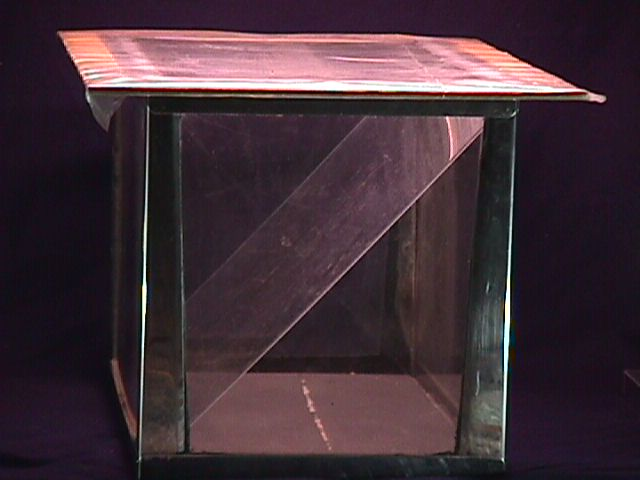
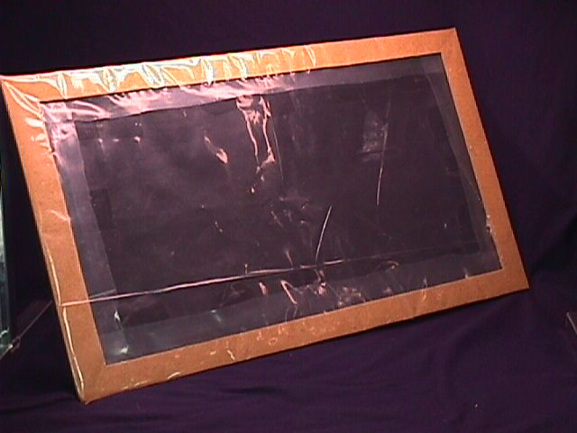

  
Standard 10 Gallon Aquarium  

  
The Airtight Aquarium Lid (Top)  

24" X 14 1/2" outside dimensions
21 1/4" x 12" inside dimensions (dimensions variable).
The frame can be made of flat (unwarped) 1/4" thick board or 4 wood strips connected by screws.

The wooden lid frames' inner rectangular cutout must be LARGER than the top of the aquarium. Clear polyethylene plastic film is tacked to the underside (or upper side) of the frame so that the frame holds it tightly onto the aquarium top. The frame essentially hangs by the plastic film. A simpler alternative is to cover the aquarium top with saran wrap or something similar. The most important point to be stressed is that the aquarium must be sealable with no air leaks, for humidity retention.

## The Spray Shield/Chamber Partition
(for a standard 10 gallon aquarium)

Use 1/8" thick clear acrylic (Plexiglas) window insulation available at most hardware stores. Have it cut around 15" x 18" (dimensions may vary - check the aquarium first). A loose fit is good as long as the cakes are protected from the direct spray.

## Dual Chambered Terrarium Techniques

The mushrooms get water from 2 sources; the substrate they grow on and the air that surrounds them. The surrounding air must be highly humidified. The fungus needs to bathe in a shroud of floating water molecules. 100% humidity is where there is the maximum number of water molecules floating amongst the air atoms. The dual chambered terrarium easily achieves these conditions.

It all starts with the spray from the hand sprayer. The first rule is to never directly spray the fungus. This initial spray is comprised of water droplets that are giant ponds of water in relation to the fine mycelial networks of the fungal threads. In culture, the droplet of water will drown the micro world of the fungal structures and thereby inhibit or contaminate growth. But the airborne molecularized water floats into the fine structures and gives the fungus humidity as needed. Molecularized water is another way of describing water that has evaporated into the air.

The spray that comes out of the spray bottle must be molecularized for the fungus. The spray shield and the primary chamber accomplish this. The primary chamber receives the initial spraying where as the shroom cakes are behind it. As the spray strikes the shield, it is broken down into a finer mist which flows around the sides of the spray shield into the secondary chamber where the fungus is bathed in the fine humidity safely away from water droplets. In a matter of time, this humidity will condense out onto surfaces inside the terrarium and drip down. The spray shield is slanted and therefore acts as a drip shield and roof, so the more condensation the better. Also, the spray shield adds more surfaces to the insides of the terrarium which increases the amount of moisture that can evaporate.

## Spraying Procedure

First, before placing the cakes into the terrarium, spray all the inside surfaces of the terrarium, including the spray shield and lid. Insert the fungus cakes and put the spray shield and lid in place. Then, slightly lift up the lid and insert the nozzle of the water spray bottle in between the lid and the top of the aquarium and vigorously spray downwards into the middle of the shield. After about 5 seconds of spraying, immediately withdraw the sprayer nozzle and let down the lid to seal the swirling mist inside the terrarium. Make sure that all the inside surfaces of the terrarium are foggy or dripping with water. This in itself helps generate humidity.

It has been seen that mushrooms will grow very well in a properly set up dual chambered terrarium, with only one good spraying a day - and even less than that. This is one of the amazing features of the PF TEK. With the cake cased, I have seen great shrooms grown like this with little attention given to the terrarium. PF style cakes actually seem to need less humidity than any other way of growing shrooms as long as the double ended cake casing technique is employed. PF cakes, when birthed, don't need 100% humidity to fruit well. It is very true, that cased grain and such need the very high humidity, but PF cakes don't. And that is because the cakes themselves humidify the space around them because of the vermiculite content. Vermiculite holds a lot of water and will both absorb and release moisture.

Each time the terrarium is sprayed, the fungus should be ventilated. To ventilate, take off the lid, and while holding the spray shield vertically, fan the chamber with a piece of cardboard, and then spray as above. Also, the water that collects in the bottom of the terrarium must be siphoned out (prevents bacteria buildup). This can be easily done using a rubber bulb battery filler (auto parts store) or a rubber bulb type enema bottle.

Expose the terrarium to normal room light (indirect sunlight). A small low wattage fluorescent plant light positioned above the terrarium will make the phototropic mushrooms grow upwards. Leave it on all the time if desired.

## Heating

The main rule is to not heat the dual chambered terrarium. Any direct heating works against the humidification andadds a drying influence. Do not use heating cables, heat pads or blankets. Don't shine light directly down into the terrarium. Keep any plant grow light (low wattage only) a safe distance from the terrarium. These fungi grow well at 60 degrees Fahrenheit. PF has even seen them growing perfectly at temperatures cooler than 60 degrees. They grow slowly when they are cool. When warm or at heated room temperature, they grow very fast. Strive for a growing temperature between 65 and the upper 80's. A too hot terrarium will result in lots of spreading mycelium, but no fruiting. It has been reported by other authors, that these cubensis mushrooms will have a higher potency when grown at cool temperatures. They grow much slower, but they seem to be denser in their flesh then when grown warm.

## Symptoms of low Humidity

When the humidity is a bit low, but not low enough to stop fruiting, the mushrooms can have fuzzy white mycelium growing on the tops of the caps. When this occurs, the cap looks like it has a crown of white hair. This is not contamination. This white fuzzy mycelium is perfectly good and does not detract from the mushrooms quality.

Deformed, convoluted, and withering mushrooms and primordia are signs of low humidity. For the best growth, the humidity has to be high.

