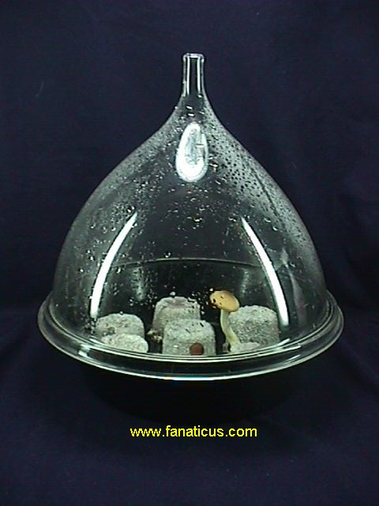
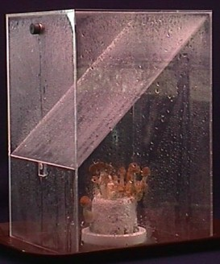
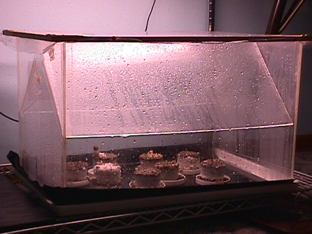

This is the terrarium that was used in the perlite and terrarium tests. I found it at a new and used resteraunt supply store in Seattle for $25. This is a covered food display tray.

It works great with perlite (and without) and holds 9 half pint cakes. The one above has 7 cakes. The cakes are post initial flush and the fruitings are secondary fruitings. The fruitbodies that appear late are always superb in form.

If you can't find one of these in your local town, you can order one for around $75 (hence - the "richmans'"). Call the manufacturer (Cal-Mil) in California at 1 800 321 9069. They will tell you where you can order it (from one of their distributers near your town).

Unfortunately, sometimes a distributer will require a minimum of an order for two. But fortunately, the terrarium they will send you for the above price is bigger than the one pictured. It has room for several more cakes, making for a goodly capacity. All the shrooms pictured at this site were grown in one of these.

The catalog numbers are:
314-15 -- the "connoisseur cover"
316-15 -- "Deep Tray" bottom half
The unit is 15 inches in diameter and about that tall.

To use this terrarium, first spray the insides. Place the cakes in. Hold the cover above the tray and spray a fine mist into the air about 2 feet above the cakes in the tray and immediately lower the cover down onto the tray - trapping mist. Air and mist once a day. But what is so cool about this, is that neglect goes a long way! (set it up and leave it).

It costs, but it works so nicely, and it makes a nice coffee table display. If your landlord comes by to inspect, he will see it, look down and say, "hey, nice shrooms, what kind are they"? Then you say, "I got it from a science catalog company and it is a new miniature fungi growing kit and the shrooms are not edible - just wild". (or something absurd like that). Then your landlord will look approvingly around, notice the neatness and tiddyness of your domecile, and leave, little knowing that he just observed the food of the gods.

## The Ultra Richmans Terrarium

This terrarium was made by a plastics fabrication expert. It isn't cheap (like a poor mans Whalmart plastic storage box) but if you can find the right person - the cost is a bit more than the richmans dome above. It is made out of acrylic clear plastic. It is one piece, with a removable spray shield. At the top, is a spray hole with a rubber stopper. It is designed to hold one fruiting cake to maturity, but it can hold 4 cakes tightly. The cake inside is a first flush PF spore race cake - typical of a first flush obtained with the pf tek.

The terrarium is open bottomed so it fits over the cakes that sit on a tray. This is the most fool proof terrarium one can have. And it can be made bigger - as big as a ten gallon aquarium or larger. The plastics expert can make one just by looking at the photo and you giving him the dimensions that you want or by giving him the tray that you have to fit the terrarium to it. Very tricky - but it isn't hard to find someone (a professional) who can do it if you live in any kind of large town.

This terrarium was built by myself out of plexiglas. It employs the Dual Chambered Terrarium techniques previously discussed in the PF TEK. This terrarium has been hooked up with humidifiers for automatic 100% humidification. It also works great with just a sprayer. The inner "roofs" make this type of terrarium as fool proof as they can get - in other words, they can't be beat for shroom growing. 