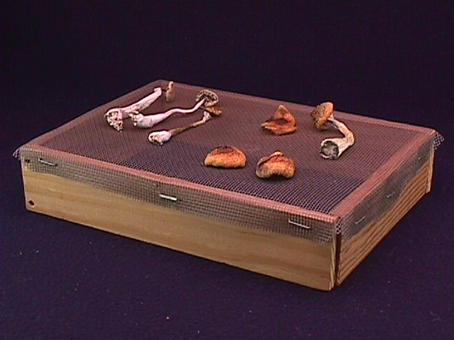
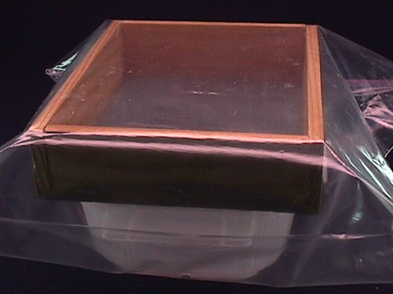
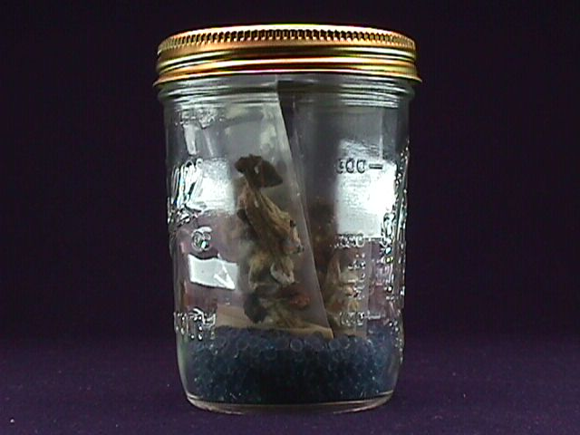

 The immature specimens are the best in quality, digestibility and potency. They are characterized as being very light in color with white stems and light colored caps. The cap will spread out after the veil breaks. Just before or right after the veil breaks is a good time to harvest. The gills on the underside of the cap will be light in color. The mushrooms will be conical shaped and sporulation hasn't really begun yet. These are the mushrooms that are the best for harvesting.
 

1. The easiest way to dry the fungi is to place them on a wire screen with air available to all sides. Never dry them in an oven or use hot air dryers. The heat leaches the chemical constituents and reduces their quality.

2. Using a frost free (dehumidifying) refrigerator works but it is time consuming and then everyone doesn't have a frost free fridge.

3. Using desiccant to cool dry mushrooms is overall, the best drying technique.

## MATERIALS NEEDED 

* Desiccant
* Wire screen
* Plastic tub or container
* Plastic bag with tie off.

## DESICCANT SOURCES

1. "DRIERITE" desiccant. (chemical and science supply retailers). It is the universal lab desiccant.
2. Silica Gel granules - desiccant. (Chemical and science supply) .

! Warning: These products might have toxicity warnings - (don't breathe the dust and try not to touch it directly - it dries skin.). Follow those rules, but know that desiccant in an airtight box and under a screen will do nothing to the fungi except dry them. It is completely safe for this use.

What desiccant does, is absorb moisture out of the air. As the fungus transpires moisture, the moisture is immediately absorbed back into the desiccant, drying the fungi. Desiccant can be reused and lasts indefinitely. After use, the desiccant is heated, dried and stored for future use. To be sure the desiccant is dry and ready to work, heat the desiccant in an oven as instructed by the manufacturer before its' first use. This preheating should be done before the desiccant is used because when it is purchased - it is usually somewhat damp which will thwart its function for drying air. Store it in an air tight container so that it stays dry and ready for use.

In drying a medium sized mushroom such as Psilocybe Cubensis, use a 2 inch layer of desiccant on the bottom of the container, under the mushrooms. Place the mushrooms on a wire screen and lay them on the desiccant that is in the container. Put the container with the shrooms and desiccant into a plastic bag. A garbage bag type wire tie is sufficient to close the bag. If a clear plastic bag can be found, use that to observe the drying process. After 24 hours, a little shriveling of the shrooms can be seen. About 4 or 5 days later, the shrooms will be dried rock hard. To check the drying - the stem should snap cleanly when bent.

!!!! Tip: For the best alkaloid preservation technique, the desiccant box can be put into the refrigerator and the mushrooms dried at near freezing temperatures.

Actually, about the easiest and most effective way to dry the mushrooms is to pre dry the mushrooms in the air on a wire screen. This works very well if the the room humidity is not high. After a couple of days, the shriveling fungus can be quickly and completely dried in the desiccant box. So a combination of air drying and then desiccant drying is one of the best ways there is to dry the mushrooms.

Mushrooms dried in this way lose hardly any chemical constituents and their truly desiccated state preserves them in their prime for months.

Store them by sealing them in plastic bags or keep them in canning jars with the rubber edged canning lid on tight (as in the photo - dried shrooms in little bags stored on top of desiccant). The freezer is a good place for preservation, but make sure the fungi are tightly sealed in their containers to protect them against the moisture in the freezer. 